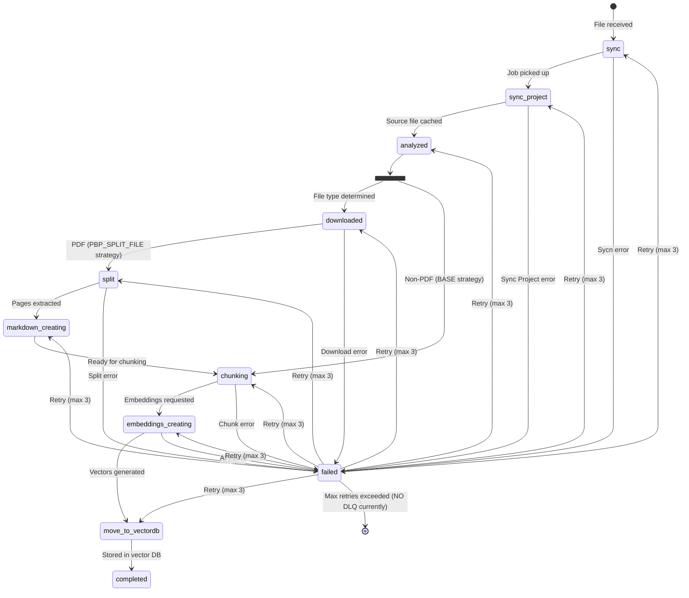

# ETL Pipeline State Machine

```mermaid
stateDiagram-v2
    [*] --> sync : File received
    sync --> sync_project : Job picked up
    sync_project --> analyzed : Source file cached

    state fork_strategy <<fork>>
    analyzed --> fork_strategy

    fork_strategy--> downloaded : File type determined
    fork_strategy --> chunking : Non-PDF (BASE strategy)

    downloaded --> split : PDF (PBP_SPLIT_FILE strategy)
    split --> markdown_creating : Pages extracted
    markdown_creating --> chunking : Ready for chunking

    chunking --> embeddings_creating : Embeddings requested
    embeddings_creating --> move_to_vectordb : Vectors generated
    move_to_vectordb --> completed : Stored in vector DB

    sync --> failed : Sycn error
    sync_project --> failed: Sync Project error
    downloaded --> failed : Download error
    split --> failed : Split error
    chunking --> failed : Chunk error
    embeddings_creating --> failed : API error

    failed --> sync : Retry (max 3)
    failed --> sync_project : Retry (max 3)
    failed --> analyzed : Retry (max 3)
    failed --> downloaded : Retry (max 3)
    failed --> split : Retry (max 3)
    failed --> markdown_creating : Retry (max 3)
    failed --> chunking : Retry (max 3)
    failed --> embeddings_creating : Retry (max 3)
    failed --> move_to_vectordb : Retry (max 3)
    failed --> [*] : Max retries exceeded (NO DLQ currently)
```

---
