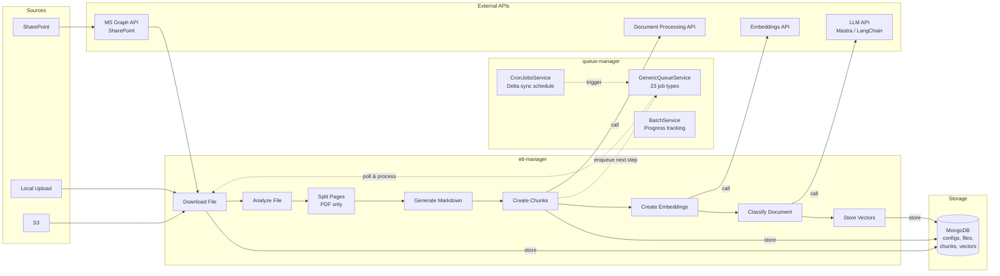

# System Data Flow

```mermaid
flowchart LR
    subgraph Sources
        SP[SharePoint]
        S3[S3]
        LO[Local Upload]
    end

    subgraph etl-manager
        DL[Download File]
        AN[Analyze File]
        SPL[Split Pages<br/>PDF only]
        MD[Generate Markdown]
        CH[Create Chunks]
        EM[Create Embeddings]
        CL[Classify Document]
        VS[Store Vectors]
    end

    subgraph queue-manager
        GQ[GenericQueueService<br/>23 job types]
        CR[CronJobsService<br/>Delta sync schedule]
        BT[BatchService<br/>Progress tracking]
    end

    subgraph Storage
        MDB[(MongoDB<br/>configs, files,<br/>chunks, vectors)]
    end

    subgraph External APIs
        DPA[Document Processing API]
        EMA[Embeddings API]
        LLM[LLM API<br/>Mastra / LangChain]
        MSG[MS Graph API<br/>SharePoint]
    end

    SP --> MSG --> DL
    S3 --> DL
    LO --> DL
    DL --> AN --> SPL --> MD --> CH --> EM --> CL --> VS
    CH -.->|enqueue next step| GQ
    GQ -.->|poll & process| DL
    CR -.->|trigger| GQ
    DL -->|store| MDB
    CH -->|store| MDB
    VS -->|store| MDB
    CH -->|call| DPA
    EM -->|call| EMA
    CL -->|call| LLM
```

---
